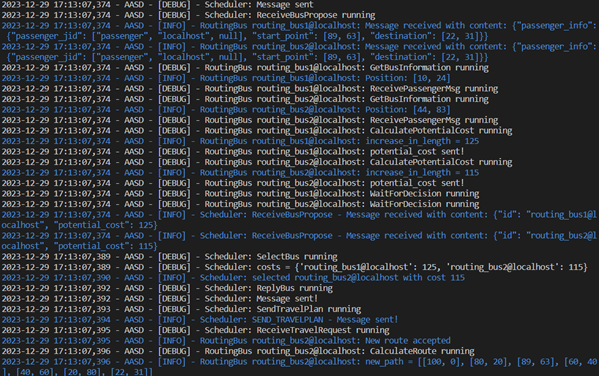
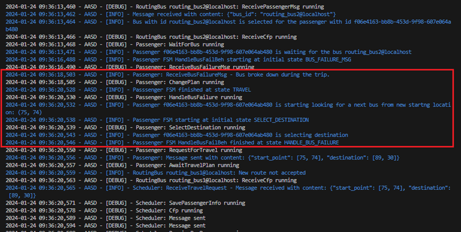
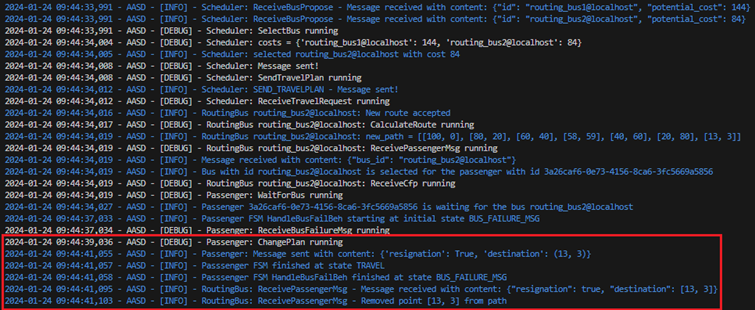

# Dynamic Timetable

## Description

The goal of our project is to create a system that provides convenient, direct public transportation. Our system will manage buses by continuously adjusting the number and routes of buses based on demand. There will be no pre-established schedules — no specific arrival and departure times or fixed bus stop locations. Buses will pick up and drop off passengers at locations of their choice.
The project contains only a simulation of a working system.

## System Concept
Passengers will request rides from one point to another via mobile applications. These requests will be sent to a central system, which will distribute the information to the buses. Each bus will then calculate the cost of picking up a new passenger based on its current status — whether it is stationary or moving (i.e., active), its location, and its list of stops. This information will be sent back to the central system, which will select the most appropriate means of transportation and relay the details to both the passenger and the chosen bus.
In cases of low demand, some buses may remain stationary.
We assume that buses will operate on a Manhattan-style grid layout, where the distance between any two points is measured as the Manhattan distance.

## Assumptions

1. The passenger has been simulated.
2. The positions of the RoutingBus and Passenger agents, as well as the Passenger agent's travel destination, are randomly drawn from a continuous distribution within the range [0, 100].
3. To simulate bus breakdowns and passenger cancellations, the program periodically randomizes the occurrence of these alternative scenarios with a specified probability.
4. For demonstration purposes, there is only 1 Passenger agent and 2 RoutingBus objects, although the system is designed to handle any number of them.
5. The default (initial) routes for both RoutingBus instances are fixed and are as follows: [[0, 0], [20, 20], [40, 40], [60, 60], [80, 80]] and [[100, 0], [80, 20], [60, 40], [40, 60], [20, 80]].

## How to run
### Windows
```bash
docker compose up -d 
./start.bat 
python .\dynamic-timetable\main.py 
```
### Linux
```bash
docker compose up -d 
container_id=$(docker compose ps -q) 
docker exec -it $container_id prosodyctl register scheduler localhost scheduler 
docker exec -it $container_id prosodyctl register passenger 
localhost passenger 
docker exec -it $container_id prosodyctl register routing_bus1 
localhost routing_bus1 
docker exec -it $container_id prosodyctl register routing_bus2 
localhost routing_bus2
```

## Program Operation
The entire process begins with the passenger selecting the coordinates of their desired destination. The main system (Scheduler) then assigns an appropriate bus for the passenger to travel to the designated location. Of course, for demonstration purposes, we are limited to the assumptions described above. There is also the possibility of a bus breakdown or the passenger canceling the ride. Below is a screenshot displaying the application's activity logs.

Zaimplementowaliśmy również opisane scenariusze alternatywne
### Bus failure

Logs related to the bus breakdown are highlighted in the red rectangle. The passenger receives a message about the bus breakdown. The passenger then decides to use the system's services again and resubmits a request for a ride to the Scheduler, restarting the entire process.
### Change in Passenger Plans

Logs related to changes in the passenger's plans are highlighted in the red rectangle. It shows that the passenger sends a cancellation message to the appropriate Routing Bus, which then removes the passenger's start and destination points from its route. It is also important to note that the Routing Bus keeps track of the start and destination points for each passenger on its route. This means that if the Routing Bus had several passengers who wanted to board or alight at the same location where a cancelling passenger is, only the point for the cancelling passenger will be removed. The remaining passengers will still be able to board or alight at their designated stops.